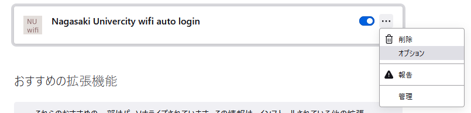

# Firefox拡張機能 Nagasaki University wifi認証自動化
---

## メニュー
* [導入手順](#導入手順)
* [参考文献](#参考文献)

## 動作確認環境
---
- windows10
- Firefox 97
## ファイル一覧
[latest_ver_xpi]: ./nagasaki_univercity_wifi_auto_login-1.1-fx.xpi
|ファイル|説明|
|:--:|:--:|
|[nagasaki_univercity_wifi_auto_login][latest_ver_xpi]|Firefox アドオン|
|[src](./src)|ソースコード|
## 導入手順
---
1. アドレスバーに `about:addons` を入力

2. 歯車マーク -> ファイルからアドオンをインストール -> `xpi` ファイル ([nagasaki_univercity_wifi_auto_login][latest_ver_xpi]) を開く -> 権限の許可を聞かれるので追加をクリック

3. IDとパスワードを追加

   1. 下記のボタンをクリック
   
   

   2. オプションをクリック
   
   

   3. `ID` と `PASSWORD` の欄に入力して `save` をクリック

   

## 参考文献
---

- Firefoxアドオン実装手順
  - [MDN Web Docs 設定ページを実装する](https://developer.mozilla.org/ja/docs/Mozilla/Add-ons/WebExtensions/Implement_a_settings_page)

- Firefoxアドオン署名・配布
  - [森林開発24時 Firefoxのアドオン開発について(配布編)](https://forest-soft.xyz/blog/detail?id=18)